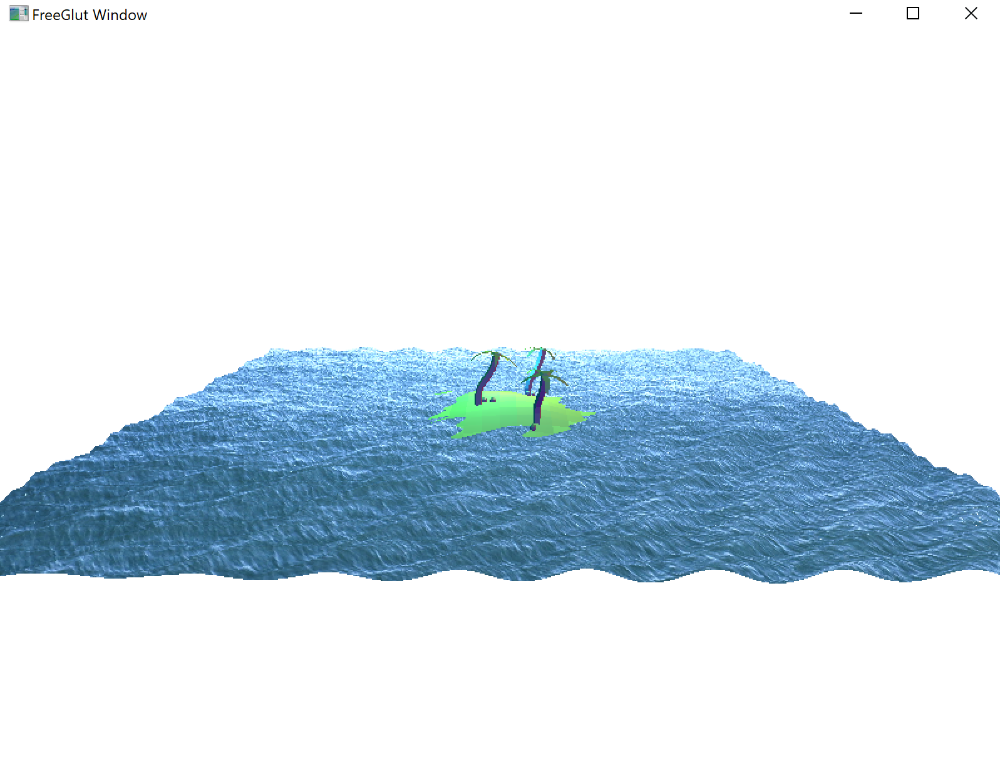
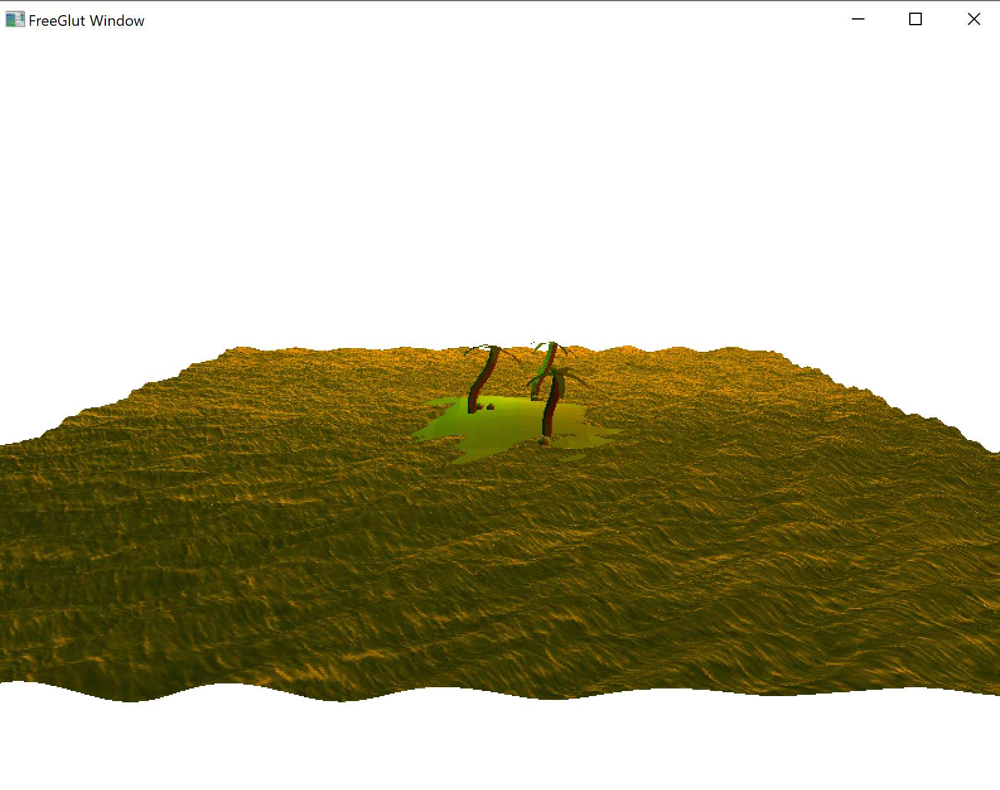
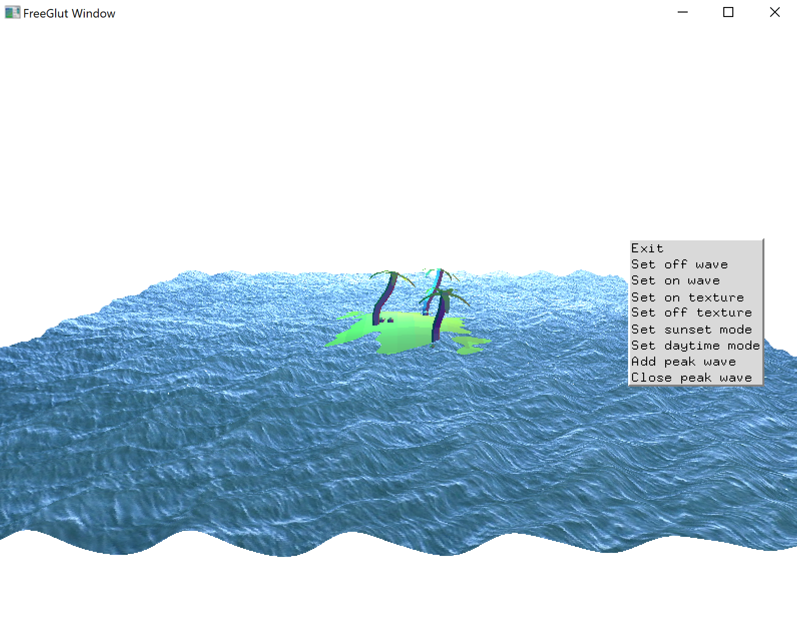

# SineWave water simulation

#### Based on the article by Nvidia : [GPU Gems Chapter1](https://developer.nvidia.com/gpugems/gpugems/part-i-natural-effects/chapter-1-effective-water-simulation-physical-models)

##### Render Effect Images (256 * 256 size grid):

1. 

2. 

3. 

4. 

